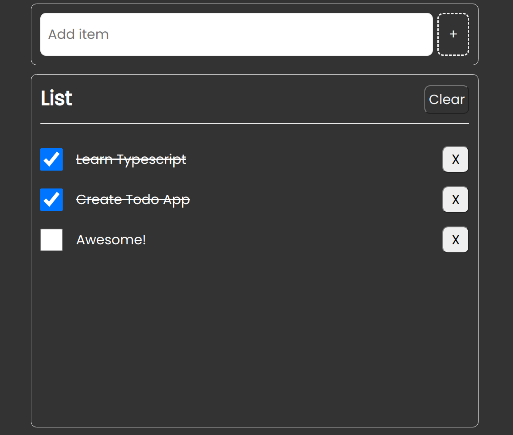

# Simple Todo App



This is a simple Todo application built using TypeScript, Vanilla JavaScript, and Vite. The application allows users to manage their daily tasks by adding, removing, marking as completed, and clearing todos. All the todo information is stored locally using the browser's local storage.

## Features

1. **Add Item**: Users can add new items to their todo list by entering the task description and pressing the "Add" button.

2. **Remove Item**: Users can remove a specific item from the todo list by clicking the "Remove" button associated with that item.

3. **Mark as Completed**: Users can mark a task as completed by clicking the checkbox next to the task description. Completed tasks will be visually indicated with a strike-through line.

4. **Clear All Todos**: Users can clear all the todos from the list by clicking the "Clear" button. This action will remove all the tasks from the list.

## Technologies Used

The following technologies were used to build this application:

- TypeScript
- Vanilla JavaScript
- Vite

## Getting Started

To get a local copy of the project up and running, follow these steps:

1. Clone the repository:

   ```bash
   git clone https://github.com/Abhipatil01/todo-typescript.git
   ```

2. Change to the project's directory:

   ```bash
   cd todo-typescript
   ```

3. Install the dependencies:

   ```bash
   npm install
   ```

4. Start the development server:

   ```bash
   npm run dev
   ```

5. Open your browser and visit `http://localhost:3000` to view the Todo application.

## How Local Storage is Used

The application uses the browser's local storage to store and retrieve the todo information. Whenever a new todo is added, removed, marked as completed, or cleared, the application updates the local storage accordingly. This ensures that the todo list persists even if the user refreshes the page or closes the browser.

## Feedback and Contributions

If you have any feedback, suggestions, or bug reports, please feel free to open an issue on the project's [GitHub repository](https://github.com/Abhipatil01/todo-typescript). Contributions are also welcome. Fork the repository, make your changes, and submit a pull request with your improvements.

## License

This project is licensed under the [MIT License](LICENSE).
